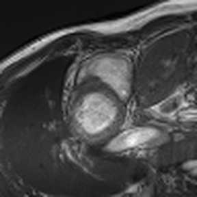
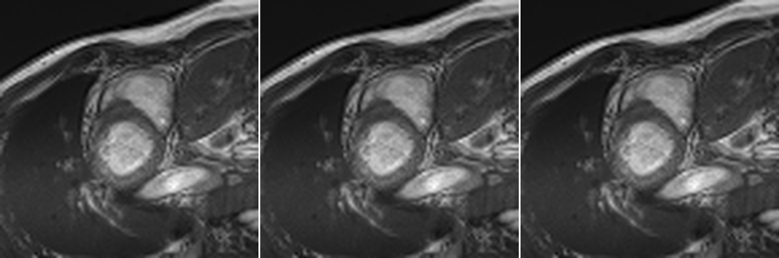

# LAUGEN: Longitudinal Augmentation and Generation from Single Images

Turn a single medical image into a temporally coherent synthetic longitudinal sequence.

<table>
<tr>
<th>Real ACDC cardiac cycle</th>
<th>LAUGEN synthetic (calibrated)</th>
</tr>
<tr>
<td></td>
<td></td>
</tr>
</table>

> Left: the same ACDC patient's real, fully-acquired 12-frame cardiac cycle (for
> context — this is what LAUGEN is trying to produce *plausible* stand-ins for,
> not to reproduce exactly). Right: one ACDC end-diastole frame → 3 synthetic
> trajectories generated by LAUGEN, one per anatomical structure (RV cavity,
> myocardium, LV cavity), each using parameters calibrated against real ACDC
> ED→ES pairs via `laugen.calibration.fit_params` (see
> `laugen/examples/calibrate_acdc.py`). Regenerate both with
> `laugen/examples/make_hero_gif.py::generate_calibrated` /
> `::generate_real_cycle` (needs real ACDC data).

## Why this exists

Longitudinal medical datasets are small and expensive to collect. Most medical imaging data is
cross-sectional — one timepoint per patient. LAUGEN generates plausible synthetic sequences from
single frames, enabling longitudinal model training on cross-sectional data, and lets a single
real observation be expanded into many synthetic trajectories.

## Install

```bash
git clone https://github.com/MIC-DKFZ/Longitudinal4DMed.git
cd Longitudinal4DMed
pip install -e .
```

## Minimal usage

```python
import numpy as np
from laugen import deform_structure

sequence = deform_structure(image, seg, time_points=np.linspace(0, 1, 8))  # (T, H, W, D)
```

## Gallery

LAUGEN currently exposes three generation modes as plain functions (no shared class/state):

### `deform_structure` — anatomy-guided spatial deformation

Displaces the image along the segmentation-boundary gradient, scaled over time — simulates
growth, atrophy, or shrinkage of the labeled structure.

```python
seq = deform_structure(img, seg, time_points, intensity=20.0, growth_max=5.0)
```

### `apply_bias_field` — progressive scanner-inhomogeneity drift

Applies a smooth multiplicative bias field, anchored inside the segmentation mask, ramping in
over the sequence — simulates scanner-to-scanner intensity inhomogeneity across visits.

```python
seq = apply_bias_field(sequence, seg, coeff=0.5)
```

### `apply_seg_intensity` — localized time-varying intensity change

Adds a time-ramped intensity shift confined (softly) to the segmentation mask — simulates
progressive signal change co-located with a lesion (e.g. contrast enhancement, FLAIR increase).

```python
seq = apply_seg_intensity(sequence, seg, alpha=0.15)
```

## Compatibility

| Input format | Supported |
|---|---|
| `numpy.ndarray` | ✓ |
| `torch.Tensor` (C, H, W) / (C, D, H, W) | ✗ |
| MONAI dict transforms | ✗ |
| batchgeneratorsv2 | ✗ |

## Demo notebook

See [`examples/demo.ipynb`](examples/demo.ipynb) for a runnable walkthrough — no bundled data required, it generates a synthetic sample inline (swap in your own `(img, seg)` arrays, e.g. a real ACDC frame, to see LAUGEN on real anatomy).

[](https://nbviewer.org/github/MIC-DKFZ/Longitudinal4DMed/blob/main/laugen/examples/demo.ipynb)

## Citation

If you find this work useful for your research, please consider citing:

```bibtex
@misc{disch2025temporalflowmatchinglearning,
      title={Temporal Flow Matching for Learning Spatio-Temporal Trajectories in 4D Longitudinal Medical Imaging}, 
      author={Nico Albert Disch and Yannick Kirchhoff and Robin Peretzke and Maximilian Rokuss and Saikat Roy and Constantin Ulrich and David Zimmerer and Klaus Maier-Hein},
      year={2025},
      eprint={2508.21580},
      archivePrefix={arXiv},
      primaryClass={cs.CV},
      url={https://arxiv.org/abs/2508.21580}, 
}
@misc{disch2025cronoscontinuoustimereconstruction,
      title={CRONOS: Continuous Time Reconstruction for 4D Medical Longitudinal Series}, 
      author={Nico Albert Disch and Saikat Roy and Constantin Ulrich and Yannick Kirchhoff and Maximilian Rokuss and Robin Peretzke and David Zimmerer and Klaus Maier-Hein},
      year={2025},
      eprint={2512.16577},
      archivePrefix={arXiv},
      primaryClass={cs.CV},
      url={https://arxiv.org/abs/2512.16577}, 
}
```
